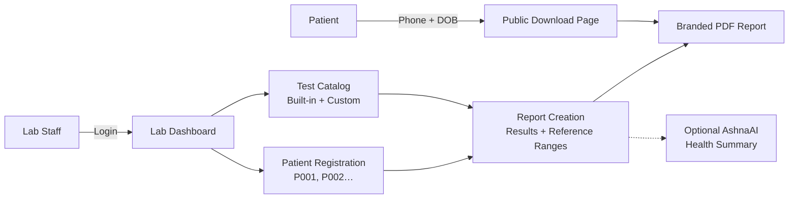
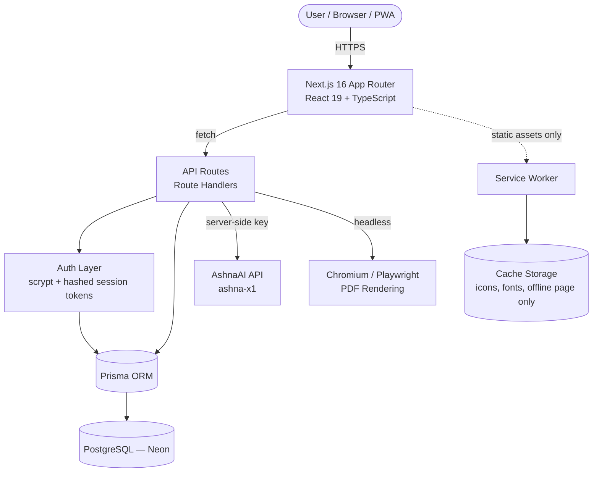

<div align="center">


# Northstar Diagnostics — LIMS

**Laboratory Information Management System**

<!--  -->

Modern clinical pathology workflow — register patients, manage test catalogs, record results, and generate professional PDF reports with secure multi-laboratory support and complete data isolation.

<a href="https://github.com/Priyanshu84iya/lims"></a>

<br />
<br />

[](https://nextjs.org)
[](https://react.dev)
[](https://www.typescriptlang.org)
[](https://tailwindcss.com)
[](https://prisma.io)
[](https://neon.tech)
[](https://web.dev/learn/pwa)
[](#-license)

</div>

---

## 📑 Table of Contents

- [About the Project](#-about-the-project)
- [How It Works](#-how-it-works)
- [Features](#-features)
- [Architecture](#-architecture)
- [Tech Stack](#-tech-stack)
- [Screenshots](#-screenshots)
- [Getting Started](#-getting-started)
- [Environment Variables](#-environment-variables)
- [Security & Privacy](#-security--privacy)
- [PWA](#-pwa)
- [API Reference](#-api-reference)
- [Project Structure](#-project-structure)
- [Roadmap](#-roadmap)
- [Contributing & Support](#-contributing--support)
- [License](#-license)
- [Meet the Developer](#-meet-the-developer)

---

## 🔬 About the Project

**Northstar Diagnostics** is a production-grade Laboratory Information Management System (LIMS) that digitizes the complete clinical pathology workflow — from patient registration to signed, printable reports.

**The problem it solves.** Small and mid-sized diagnostic laboratories often rely on paper registers and spreadsheets to manage patients, test results, and reports. That leads to lost records, manual report formatting, no audit trail, and no secure way for patients to retrieve their own results.

**Who it's for.**

- **Laboratories** — register patients, record pathology results, and print professional PDF reports under their own branding.
- **Platform administrators** — onboard and manage multiple laboratories from a single admin console.
- **Patients** — retrieve their completed reports through a secure public verification page, no account needed.

**How the system works.** Each laboratory gets its own isolated workspace. Lab staff authenticate with lab credentials, register patients (auto-generated IDs like `P001`), build reports from a built-in pathology test catalog (or their own custom tests), record parameter results against age/sex-specific reference ranges, and export a branded PDF. Patients download completed reports from the public site by verifying their registered mobile number and date of birth.

---

## ⚙️ How It Works



---

## ✨ Features

### Core Platform

<table>
<tr>
<td width="50%" valign="top">

**🏥 Multi-Laboratory Management**
Admin console to create and manage laboratories, each with its own login credentials, profile, logo, and authorized signature.

</td>
<td width="50%" valign="top">

**🔐 Lab-Level Data Isolation**
Every patient, report, and custom test is scoped to its laboratory. Labs can only ever query their own data.

</td>
</tr>
<tr>
<td width="50%" valign="top">

**🧾 Patient Registration**
Auto-generated sequential patient IDs (`P001`, `P002`, …) with full demographics, contact details, and referring doctor.

</td>
<td width="50%" valign="top">

**🧪 Pathology Test Catalog**
Built-in catalog covering hematology (CBC, ESR), biochemistry (LFT, KFT, lipid profile, HbA1c), thyroid, serology, urine, and hormones — plus lab-defined custom tests with age/sex-specific reference ranges.

</td>
</tr>
<tr>
<td width="50%" valign="top">

**📊 Report Workflow**
Draft → Completed → Finalized lifecycle. Parameter results are automatically flagged against reference ranges. Barcode on every report.

</td>
<td width="50%" valign="top">

**📄 Professional PDF Reports**
Server-side PDF generation via headless Chromium with lab branding, logo, authorized signature, and patient/report metadata.

</td>
</tr>
<tr>
<td width="50%" valign="top">

**🤖 AI-Assisted Analysis (AshnaAI)**
Optional AI summary of a report's findings — abnormal results, possible concerns, and next steps — clearly framed as health information, not a diagnosis.

</td>
<td width="50%" valign="top">

**📱 Public Report Download**
Patients retrieve completed reports without an account by verifying their registered mobile number + date of birth. HMAC-signed, short-lived download tokens with IP throttling.

</td>
</tr>
<tr>
<td width="50%" valign="top">

**💬 LIMS Assistant Chatbot**
WhatsApp-inspired AI assistant on public pages, answering questions about the website and its features via AshnaAI.

</td>
<td width="50%" valign="top">

**📥 Installable PWA**
Add to home screen on Android, Windows, and desktop browsers. Standalone launch, branded offline page, and a safe update flow — with zero caching of medical data.

</td>
</tr>
<tr>
<td width="50%" valign="top">

**✉️ Contact & Message Management**
Public contact form feeding an admin inbox with read/unread tracking.

</td>
<td width="50%" valign="top">

**📱 Responsive Design**
Mobile-first layouts, safe-area insets, and touch-friendly targets across public and dashboard pages.

</td>
</tr>
</table>

<details>
<summary><b>📖 Full feature breakdown</b></summary>

| Area | Details |
|---|---|
| Authentication | Admin + Lab roles, scrypt password hashing, hashed session tokens, HttpOnly cookies |
| Admin console | Lab CRUD, logo & signature uploads (JPG/PNG/WEBP, ≤5 MB), message inbox |
| Lab dashboard | Stat cards (reports, patients, tests), recent activity |
| Reception | Patient registration with search by code/name/phone/email |
| Reports | Create from catalog or custom tests, per-parameter results, status computed from reference ranges |
| PDF | Barcode, QR, lab branding, optional AI analysis section |
| Public site | Home, About, Contact, Download Report, Login |
| PWA | Manifest, service worker, offline page, install prompt, update banner |

</details>

> All features listed above are **implemented and verified in the codebase**. See [Roadmap](#-roadmap) for planned work.

---

## 🏗 Architecture



**Key architectural decisions**

- **Server-side AI proxy** — the AshnaAI API key never reaches the browser; both the report analyzer and the public chatbot call it through server routes.
- **Contract-based Prisma** — the schema lives at `src/prisma/contract.prisma` and generates a typed contract (`npm run contract:emit`), queried via `db.orm.public.<Model>`.
- **PDF via Chromium** — reports render from an HTML template with headless Chromium (`playwright-core`), producing pixel-perfect branded documents.
- **Security-first PWA** — the service worker uses network-only behavior for every API and authenticated route; only icons, fonts, and the offline page are cached.

---

## 🧰 Tech Stack

| Category | Technology |
|---|---|
| Framework | [Next.js 16](https://nextjs.org) (App Router, Turbopack) |
| UI | [React 19](https://react.dev), [TypeScript 5](https://www.typescriptlang.org) |
| Styling | [Tailwind CSS 4](https://tailwindcss.com), [shadcn/ui](https://ui.shadcn.com), [lucide-react](https://lucide.dev) |
| Database | [PostgreSQL](https://www.postgresql.org) on [Neon](https://neon.tech) |
| ORM | [Prisma 8](https://prisma.io) (prisma-next contract pattern) |
| AI | [AshnaAI](https://ashna.ai) — `ashna-x1` model (report analysis + website assistant) |
| PDF | `playwright-core` (headless Chromium), barcode & QR rendering |
| PWA | Web App Manifest, custom service worker, install & update flow |

---

## 📸 Screenshots

> **Note:** Real UI screenshots have not been added to this repository yet. The table below lists **placeholders** — see [docs/screenshots/README.md](docs/screenshots/README.md) for capture instructions, then replace this section with actual images.

| View | Preview |
|---|---|
| Public landing page | <i>placeholder — add `docs/screenshots/home.png`</i> |
| Admin / Lab login | <i>placeholder — add `docs/screenshots/login.png`</i> |
| Lab dashboard | <i>placeholder — add `docs/screenshots/dashboard.png`</i> |
| Patient registration | <i>placeholder — add `docs/screenshots/reception.png`</i> |
| Report creation | <i>placeholder — add `docs/screenshots/report-new.png`</i> |
| Generated PDF report | <i>placeholder — add `docs/screenshots/report-pdf.png`</i> |
| Public report download | <i>placeholder — add `docs/screenshots/download-report.png`</i> |
| LIMS Assistant chatbot | <i>placeholder — add `docs/screenshots/chatbot.png`</i> |
| PWA install prompt | <i>placeholder — add `docs/screenshots/pwa-install.png`</i> |

---

## 🚀 Getting Started

### Prerequisites

- **Node.js 20+**
- **PostgreSQL 15+** (a [Neon](https://neon.tech) project works out of the box)
- A **Chromium/Chrome executable** on the server for PDF generation (production needs `PLAYWRIGHT_CHROMIUM_PATH`)
- An **AshnaAI API key** for AI features (optional — the app runs without it; AI endpoints return an error message)

### 1. Clone and install

```bash
git clone https://github.com/Priyanshu84iya/lims.git
cd lims
npm install
```

### 2. Configure environment

Copy [`.env.example`](.env.example) to `.env` and fill in your values (see the [Environment Variables](#-environment-variables) table):

```bash
cp .env.example .env
```

### 3. Set up the database

This project uses the Prisma **contract pattern** — the schema lives at `src/prisma/contract.prisma` and the configuration at [prisma.config.ts](prisma.config.ts). Apply the migrations from the [`migrations/`](migrations) directory, then generate the typed contract used by the app:

```bash
npx prisma migrate deploy   # apply existing migrations
npm run contract:emit        # regenerate the typed Prisma contract
```

### 4. Seed the platform admin

```bash
npx tsx scripts/seed-admin.ts
```

Uses `ADMIN_EMAIL` / `ADMIN_PASSWORD` / `ADMIN_NAME` from the environment (defaults: `admin@northstar.local` / `Admin@12345` — **change after first login**).

### 5. Run

```bash
npm run dev        # development server → http://localhost:3000
npm run build      # production build
npm run start      # production server
```

Log in at `/login` as the seeded admin, create a laboratory, then log in with the lab's credentials to start registering patients and creating reports.

<details>
<summary><b>🛠 Utility scripts</b></summary>

| Script | Purpose |
|---|---|
| `npx tsx scripts/seed-admin.ts` | Seed the default platform admin |
| `npx tsx scripts/reset-lab-password.ts <email> <newPassword>` | Reset a lab's password |
| `npx tsx scripts/inspect-db.ts` | Dump labs, patients, reports, and sessions for debugging |
| `npx tsx scripts/cleanup-orphans.ts` | Find and clean up orphaned patients/reports with no lab |
| `node scripts/check-null-labid.mjs` | Count patients/reports with NULL `labId` (data-integrity check) |
| `node scripts/test-isolation.mjs` | Test multi-lab data isolation against a running dev server |
| `node scripts/generate-pwa-icons.mjs` | Render PWA PNG icons from `public/icon.svg` |

</details>

---

## 🔑 Environment Variables

| Variable | Required | Description |
|---|---|---|
| `DATABASE_URL` | ✅ Yes | PostgreSQL connection string (Neon pooled connection works) |
| `ASHNA_API_KEY` | ⚠️ For AI | AshnaAI API key — server-side only, powers report analysis and the chatbot |
| `ASHNA_CHAT_MODEL` | No | Override the AshnaAI chat model (default: `ashna-x1`) |
| `PLAYWRIGHT_CHROMIUM_PATH` | No | Path to the Chromium/Chrome executable for PDF generation |
| `REPORT_ACCESS_SECRET` | No | HMAC secret for public report download tokens (falls back to `AUTH_SECRET`, then `DATABASE_URL`) |
| `AUTH_SECRET` | No | Fallback secret for signing operations |
| `ADMIN_EMAIL` | No | Seed admin email (default: `admin@northstar.local`) |
| `ADMIN_PASSWORD` | No | Seed admin password (default: `Admin@12345`) |
| `ADMIN_NAME` | No | Seed admin display name |

> **Never commit `.env`.** All secrets above are read server-side only; none are exposed to the browser.

---

## 🔒 Security & Privacy

This system handles medical data, so security was a first-class design constraint:

| Control | Implementation |
|---|---|
| Password storage | `scrypt` hashing with per-user salt; verification via `timingSafeEqual` |
| Sessions | Random 32-byte tokens; only the **SHA-256 hash** is stored in the database; 7-day expiry |
| Cookies | `HttpOnly`, `SameSite=Lax`, `Secure` in production (`lims_session`) |
| Route protection | Middleware redirects unauthenticated users away from all app routes |
| Multi-tenant isolation | Every lab query is scoped by `labId`; an isolation test script (`scripts/test-isolation.mjs`) verifies cross-lab access is denied |
| Public report access | Phone + DOB verification, **HMAC-signed short-lived tokens**, IP-based rate limiting, and no enumerable report IDs — prevents IDOR |
| AI key handling | `ASHNA_API_KEY` is used exclusively in server routes; the browser never sees it |
| File uploads | Logo/signature uploads restricted by MIME type and 5 MB size limit |
| PWA caching | The service worker **never caches** API responses or authenticated pages — only icons, fonts, and the offline page |
| AI output framing | AI analysis is explicitly labeled health information, not a medical diagnosis |

---

## 📲 PWA

Northstar LIMS is a fully installable Progressive Web App:

- **Installable** — manifest with 192/512 px icons (including maskable variants) and an Apple touch icon; custom install prompt on supported browsers.
- **Standalone** — launches in its own window, no browser chrome, with `standalone` display and a teal theme color.
- **Offline-safe** — a branded offline page is shown when the network is unavailable; sensitive routes fall back to it too rather than serving stale data.
- **Safe caching policy** — static assets (icons, fonts, build output) are cached for speed; **every API call and authenticated page is network-only**, so medical data is never stored in browser cache storage.
- **Update flow** — a new service worker activates via `SKIP_WAITING` and the app reloads cleanly on `controllerchange`, with an in-app update banner.

---

## 🔌 API Reference

| Method | Endpoint | Auth | Description |
|---|---|---|---|
| POST | `/api/auth/login` | — | Authenticate admin or lab, set session cookie |
| POST | `/api/auth/logout` | Session | Destroy session |
| GET | `/api/auth/me` | Session | Current user (role, name, labId) |
| GET | `/api/admin/labs` | ADMIN | List all labs with counts |
| POST | `/api/admin/labs` | ADMIN | Create a lab |
| GET | `/api/admin/labs/[id]` | ADMIN | Get one lab profile |
| PATCH | `/api/admin/labs/[id]` | ADMIN | Update lab profile / password |
| POST | `/api/admin/labs/logo` | ADMIN | Upload lab logo (JPG/PNG/WEBP, ≤5 MB) |
| POST | `/api/admin/labs/signature` | ADMIN | Upload lab signature (PNG, ≤5 MB) |
| GET | `/api/admin/messages` | ADMIN | List contact messages + unread count |
| PATCH | `/api/admin/messages/[id]` | ADMIN | Mark message read/unread |
| DELETE | `/api/admin/messages/[id]` | ADMIN | Delete a message |
| POST | `/api/ai-analysis` | LAB | AI health summary of a report (AshnaAI) |
| POST | `/api/chatbot` | — | Public LIMS Assistant (AshnaAI) |
| POST | `/api/contact` | — | Submit a contact message |
| GET | `/api/custom-tests` | LAB | List lab's custom tests |
| POST | `/api/custom-tests` | LAB | Create a custom test |
| GET | `/api/lab` | LAB | Own lab profile |
| GET | `/api/patients` | LAB | List patients (`?q=` search) |
| POST | `/api/patients` | LAB | Register patient (auto ID `P001`…) |
| GET | `/api/patients/[id]` | LAB | Patient with reports & tests |
| POST | `/api/public/verify-report` | — | Verify phone + DOB → HMAC download tokens (IP-throttled) |
| POST | `/api/public/download-report` | Signed token | Download report PDF (COMPLETED/FINALIZED only) |
| GET | `/api/reports` | LAB | One report (`?id=`) or all (`?patientId=`) |
| POST | `/api/reports` | LAB | Create report with results |
| POST | `/api/reports/[id]/pdf` | LAB | Generate PDF via headless Chromium |
| GET | `/api/tests` | ADMIN / LAB | Built-in test catalog |

---

## 🗂 Project Structure

```
lims/
├── migrations/                  # Prisma migrations + snapshots
├── public/
│   ├── icons/                   # PWA icons (192/512, maskable, apple-touch)
│   ├── uploads/labs/            # Lab logos & signatures
│   ├── manifest.webmanifest     # PWA manifest
│   ├── sw.js                    # Service worker (security-first caching)
│   └── icon.svg                 # Brand logo
├── scripts/                     # Seed, inspect, reset-password, isolation tests
├── src/
│   ├── middleware.ts            # Auth route protection
│   ├── app/
│   │   ├── (public)/            # Home, About, Contact (public layout)
│   │   ├── admin/               # Admin console (labs, messages)
│   │   ├── api/                 # API route handlers (see API Reference)
│   │   ├── components/          # App shell, report workspace, PWA provider
│   │   ├── dashboard/           # Lab dashboard
│   │   ├── login/               # Admin / Lab login
│   │   ├── patients/            # Patient list & detail
│   │   ├── reception/           # Patient registration
│   │   ├── reports/             # Report list, detail, creation
│   │   ├── tests/               # Test catalog view
│   │   ├── download-report/     # Public report download
│   │   └── offline/             # PWA offline page
│   ├── components/              # Shared UI (uploads, shadcn/ui primitives)
│   ├── lib/
│   │   ├── auth.ts              # scrypt + session management
│   │   ├── ai-analysis.ts       # AshnaAI client
│   │   └── laboratory/          # Built-in pathology test catalog
│   └── prisma/
│       ├── contract.prisma     # Prisma schema (contract pattern)
│       └── db.ts                # Prisma client
├── prisma.config.ts             # Prisma configuration
└── package.json
```

---

## 🗺 Roadmap

- [x] Multi-lab management with data isolation
- [x] Patient registration & search
- [x] Built-in pathology catalog + custom tests
- [x] Report workflow with reference-range flagging
- [x] Branded PDF generation (headless Chromium)
- [x] AI-assisted report analysis (AshnaAI)
- [x] Public chatbot assistant
- [x] Secure public report download (phone + DOB, HMAC tokens)
- [x] Installable PWA with offline support
- [ ] Real UI screenshots in README
- [ ] Lab-side report finalization workflow enhancements
- [ ] Email/SMS notification when a report is completed
- [ ] Role-based access control within a lab (technician vs. admin)

---

## 🤝 Contributing & Support

This is a personal project, but bug reports and suggestions are welcome via [GitHub issues](https://github.com/Priyanshu84iya/lims/issues).

If you find this project useful, you can [support the developer on Buy Me a Coffee](https://www.buymeacoffee.com/priyanshu6o) ☕

---

## 📄 License

No license has been specified for this repository yet. All rights are currently reserved by the author. If you intend to reuse or adapt this code, please reach out first or watch this section for an upcoming license.

---

## 👨‍💻 Meet the Developer

<div align="center">

**Priyanshu Chaurasiya**

*Full-stack developer — building practical, security-conscious web applications.*

<br />

[](https://www.priyanshu.engineer/)
[](https://github.com/Priyanshu84iya)
[](https://www.linkedin.com/in/priyanshu-chaurasiya-8986a833b/)
[](https://g.dev/priyanshu26)
[](https://www.buymeacoffee.com/priyanshu6o)

</div>

---

<div align="center">

<sub>Built with ❤️ by [Priyanshu Chaurasiya](https://www.priyanshu.engineer/)</sub>

<sub>⭐ Star the [repository](https://github.com/Priyanshu84iya/lims) if you found it useful!</sub>

</div>


